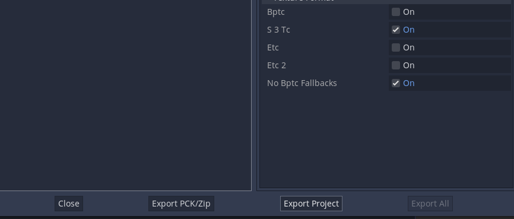

## Instalación

Godot Engine puede ser instalado como un archivo ejecutable desde su sitio web:
([https://godotengine.org](https://godotengine.org/)), sin embargo es posible
instalarlo desde distintos repositorios de Linux. De ser así, utilizar el
administrador de la distribución. En mi caso es Arch, por lo tanto se usa el
comando `sudo pacman -S godot`. La versión de Godot utilizada es la 3.3.2

## Programación del juego

En mi caso, obtuve mucha inspiración de varios juegos como Metroid y Zelda que
tienen un diseño de calabozos y un modo de progreso muy abierto basado en la
exploración, por lo que quise traducir eso a una aventura de texto. Pero primero que
nada fue necesario programar las bases para tener un juego parecido a Zork y
otros juegos de texto que presentan procesamiento de comandos.

La mayoría de tutoriales, e incluso los ejemplos vistos en clase, son
códigos compuestos por `if` anidados o `match` y otras estructuras sencillas que
no permiten tanta flexibilidad. Una vez tomada una decisión, no hay marcha
atrás, el código solo sigue adelante y si deseas tomar otro camino necesitas
reiniciar la partida.

Decidí tomar un camino distinto, decidí programar una especie de mapa de cuartos
interconectados, y después programar el procesamiento con funciones para
moverse, mirar e interactuar con objetos, puertas, etc. Esto significa que las
únicas decisiones que tomar no se ven limitadas por un menú de cosas a elegir,
sino por los cuartos desbloqueados y los objetos disponibles en el mismo.

En Godot, se utilizan nodos, que son entes presentes en estructuras llamadas
Escenas, los nodos pueden contener scripts y presentan propiedades que permiten
su uso de acuerdo a las circunstancias. Se estructura a manera de árbol, lo cual
permite que sean llamadas por los nodos raíz, sin embargo, también pueden
llamarse nodos de una misma jerarquía o incluso una mayor, por medio de señales
o usando funciones como `get_parent()`

Las escenas permiten estructurar elementos gráficos de nuestro juego. Debido a
que mi juego no usa una terminal tal cual, he tenido que utilizar los nodos de
tipo `Control` para crear interfaces graficas de salida y entrada de texto

El editor de texto integrado en la interfaz es bastante flexible, posee
autocompletado y permite acceder de forma rápida a todos los scripts abiertos.
En general utilizo VIM, sin embargo, hay algunas funciones integradas en Godot
que hacen que su editor valga la pena

Ahora, en lo que a código se refiere, este ha sido mucho mas complejo de lo
esperado y su explicación resultara algo extensa. Por lo tanto, resumiré lo mas
posible los nodos y funciones que se realizaron.

1. **Nodo Game:** Este nodo contiene todo el juego y el código que conecta todo
   lo demás. Sus funciones se encargan de lo siguiente:
   * Asigna un cuarto inicial al jugador:
   * Asigna el mensaje inicial del juego
   * Actualiza la ubicación del jugador
   * Muestra el texto y limita el scrollback (lineas de texto permitidas)
2. **Nodo Player:** Este es hijo del nodo `Game` y esta relacionado con todo lo
que el jugador puede hacer en cuanto a interacción se refiere. Posee funciones
que se encargan de:
   * Almacena los objetos tomados por el jugador
   * Se deshace de los objetos del jugador
   * Muestra los objetos disponibles
3. **Nodo CommandProcessor:** Este nodo posee uno de los scripts mas extensos,
   pues tiene y llama a muchas funciones de otros nodos, se encarga de las
   siguientes funciones:
   * Asigna al nodo Player como tal
   * Procesa los comandos disponibles por medio de `match` y llama funciones según lo escrito
   * Almacena los mensajes de ayuda y también las respuestas que son llamadas por el nodo `Game` 
   * Posee el comando que termina el juego
   * Posee la función que cambia la posición del jugador (llamada por `Game`)
4. **Nodo RoomManager:** Este nodo almacena todos los cuartos disponibles como
   nodos hijos. Se encarga de las siguientes funciones:
   * Genera los objetos que se requerirán durante el juego
   * Asigna los objetos a un cuarto
   * Asigna un uso a los objetos
   * Interconecta todas las habitaciones
   * Determina que habitaciones estarán bloqueadas.
5. **Clase Room:** Cada cuarto hijo de `RoomManager` es una escena que posee
   una clase especial `Room`, esto almacena distintas propiedades del cuarto
   representado, tales como el nombre, descripción y detalles del mismo, posee
   funciones que sirven para retornar dichos valores de texto de forma
   organizada
6. **Nodo PanelBackground:** Este nodo es de tipo `Control` y esta relacionado
   con la interfaz grafica del juego, no tiene código alguno, solo una
   estructura de nodos hijos que permiten que el texto y demás no se salgan del
   cuadro, muestre el texto mas nuevo en la parte inferior y demás. Considérese
   como el CSS que hace que el texto plano tome forma.

## Compilación del juego

Para compilar un juego hecho con Godot Engine, lo mejor es revisar la
documentación al respecto.[^1]

Sin embargo, de forma resumida es lo siguiente:

1. Tener Godot Engine instalado
2. Abrir el proyecto desde Godot
3. Descargar las plantillas de exportación

4. Una vez descargadas, ir a Proyecto/Exportar
5. Seleccionar la plataforma deseada y dar clic a Exportar Proyecto

6. Seleccionar el directorio donde guardar el archivo y guárdelo

## Como correr el juego

### En Linux

Es posible correr el juego tan presionando F5 desde la interfaz de Godot, sin
embargo, para correr el ejecutable, solo asegurese de que tenga permisos de
ejecucion, asi como de que el archivo `.pck` este presente dentro del mismo
folder que el binario. Luego, use `./nombre_archivo` desde la terminal para
correrlo

### En Windows

Busque el archivo `.exe` y asegurese que este en el mismo directorio que le
archivo `.pck`, luego, haga doble clic para ejecutarlo

[^1]: Documentación: [https://docs.godotengine.org/es/stable/getting_started/step_by_step/exporting.html](https://docs.godotengine.org/es/stable/getting_started/step_by_step/exporting.html)

# Como jugar (guia)

Estas en una casa abandonada, muevete entre las habitaciones y cuartos, mira a
tu alrededor y usa objetos para hacerte paso por los obstaculos que encuentres

## Comandos

Puedes ver los comandos disponibles dentro del juego en cualquier momento
escribiendo `ayuda`

## Guia rapida

- Ve al baño y toma la llave
- Ve al norte en la habitacion y toma la nota
- Ve al baño y al este, al este de nuevo en el comedor
- Ve al norte, es la cocina, toma el cuchillo
- Ve al sur, el invernadero, usa la llave
- Ve al este, toma el desarmador
- Regresa a la sala, ve al pasillo al norte
- Usa la nota para ingresar el codigo de la habitacion principal, ve al norte
- Usa el cuchillo para forzar el ropero, ve al este
- Usa el desarmador para abrir la ventila, ve al norte
- Toma la palanca, regresa al cuarto principal, o ve al oeste por el pasillo secreto
- Entra al baño, toma la llave principal, usa la palanca para abrir la puerta del baño o rodea.
- Dirigete a la sala
- Usa la llave
- Dirigete al sur para salir al patio frontal
- Dirigete al sur para volver al menu principal

## Diagrama de flujo / mapa

Debido a que este juego es mas un mundo en el que interactúas por texto, en vez
de un menú anidado de decisiones, el diagrama de flujo de posibilidades resulta
bastante extenso, sin embargo, el siguiente mapa sirve para representar las
ubicaciones, los objetos en ellas y los requerimientos para accederla, también
es una guía rápida de la ruta a seguir

